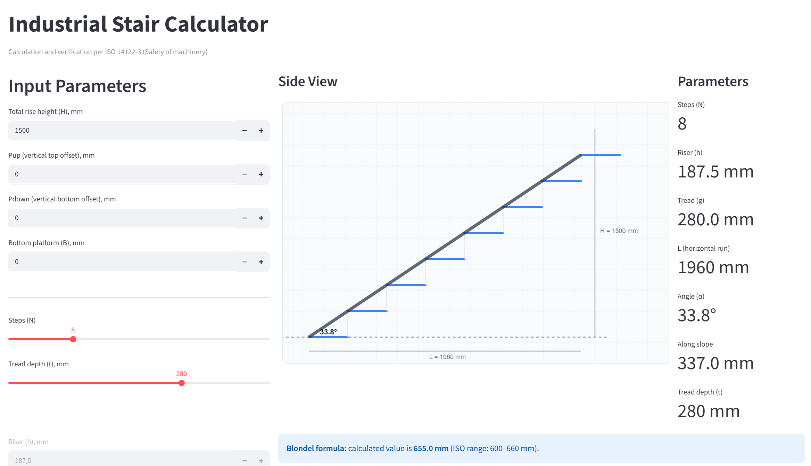

# Industrial Stair Calculator

A Streamlit-based tool for calculating and verifying industrial stairs and stepladders per **ISO 14122-3:2016** (Safety of machinery — Permanent means of access to machinery — Part 3: Stairs, stepladders and guard-rails).

## Languages

| File | Language |
|------|----------|
| `stair.py` | English |
| `stair_ru.py` | Russian |

## Features

- Geometry calculation from step count (N), tread (g) and overlap (r)
- Bottom platform (B), bottom offset (Pdown) and top offset (Pup) support
- Automatic type detection: **Stairs** (20°–45°) or **Stepladders** (45°–75°)
- ISO 14122-3 compliance checks:
  - Inclination angle
  - Blondel formula (600 ≤ g + 2h ≤ 660)
  - Minimum tread depth (g)
  - Maximum riser height (h)
- Side-view SVG visualization with dimensions (H, L, angle, B, Pdown, Pup)
- Real-time feedback — compliant steps in blue, violations in red

## Quick Start (Windows)

```bash
install.bat   # create venv and install dependencies
start.bat     # launch EN version
start_ru.bat  # launch RU version
```

## Manual Install

```bash
git clone <repo-url>
cd the-stair-calculator-ISO-14122
python -m venv venv
venv\Scripts\activate     # Windows
source venv/bin/activate  # Linux/macOS
pip install -r requirements.txt
streamlit run stair.py    # or stair_ru.py
```

## Input Parameters

| Parameter | Description | Range |
|-----------|-------------|-------|
| **H** | Total rise height, mm | 300–4000 |
| **Pup** | Vertical top offset, mm | 0–1000 |
| **B** | Bottom platform, mm | 0–1000 |
| **Pdown** | Vertical bottom offset, mm | 0–1000 |
| **N** | Number of steps | 1–30 |
| **r** | Overlap (tread overhang), mm | 0–50 |
| **g** | Tread (step run), mm | 150–320 |
| **t** | Total tread depth (g + r), mm | computed |

## Calculation

- Net rise height: `H_net = H − B − Pdown − Pup`
- Riser height: `h = H_net / N`
- Total tread depth: `t = g + r`
- Horizontal run: `L = (N−1)·g + (B+Pdown+Pup)/tan(α)`
- Inclination angle: `α = atan(h / g)`

## ISO 14122-3:2016 Requirements

| Type | Angle | Tread (g) min | Riser (h) max | Blondel (g+2h) |
|------|-------|---------------|---------------|----------------|
| Stairs | 20°–45° | 200 mm | 240 mm | 600–660 mm |
| Stepladders | 45°–75° | 150 mm | 250 mm | — |

## Stack

- **Python 3** + **Streamlit**
- Pure SVG rendering (no extra libraries)
- Single-file app (`stair.py` / `stair_ru.py`)

## Version

**1.8** — Latest release. See version tag in the app footer.

## Reference

**ISO 14122-3:2016** — Safety of machinery — Permanent means of access to machinery — Part 3: Stairs, stepladders and guard-rails.
